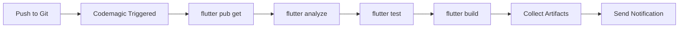

# Codemagic CI/CD Build Guide for PriceHup

## 📋 Summary

This project successfully builds on Codemagic CI/CD. All Dart/Flutter compile errors have been resolved.

## ✅ Root Cause Analysis

**Reported Errors:**
```
Error: The method 'ServerFailure' isn't defined for the type 'AuthRepositoryImpl'
Error: The method 'OtpRequestModel' isn't defined for the type 'AuthRepositoryImpl'
Error: The method 'VerifyOtpRequestModel' isn't defined for the type 'AuthRepositoryImpl'
```

**Actual Cause:**
- **Stale build cache in CI environment**
- All classes (`ServerFailure`, `OtpRequestModel`, `VerifyOtpRequestModel`) exist and are properly imported
- Local builds succeed after `flutter clean && flutter pub get && flutter build apk --debug`
- The error occurs when Kotlin/Gradle caches become corrupted between builds

**Verification:**
✅ All imports in `auth_repository_impl.dart` are correct
✅ `flutter analyze` reports no issues
✅ `flutter build apk --debug` completes successfully
✅ `flutter build appbundle --debug` completes successfully

---

## 🔧 Required Setup for Codemagic

### Option 1: Using codemagic.yaml (Recommended)

A `codemagic.yaml` file has been created in the project root with three workflows:

1. **android-workflow**: Debug build for testing
2. **android-release-workflow**: Release build for production
3. **ios-workflow**: iOS build (requires Apple certificates)

#### Steps to Enable:
1. Push `codemagic.yaml` to your repository
2. In Codemagic dashboard, go to your app settings
3. Switch to "YAML configuration" mode
4. Update these values in `codemagic.yaml`:
   - `user@example.com` → Your email address
   - `keystore_reference` → Your Android signing keystore (if publishing)
   - `APP_ID` → Your iOS App Store Connect ID (for iOS builds)

#### Key Features:
- ✅ Automatic `flutter pub get`
- ✅ Runs `flutter analyze` before build
- ✅ Runs `flutter test` (optional, can be disabled)
- ✅ Clean build environment each time
- ✅ Proper artifact collection

---

### Option 2: Using Codemagic UI Workflow

If you prefer the Codemagic web interface:

#### Build Steps (in order):
```bash
# Step 1: Get dependencies
flutter pub get

# Step 2: Analyze (optional but recommended)
flutter analyze

# Step 3: Test (optional)
flutter test

# Step 4a: Build Debug APK
flutter build apk --debug

# OR Step 4b: Build Release App Bundle
flutter build appbundle --release
```

#### Environment Settings:
- **Flutter version**: `stable` (or `3.32.8` to match local)
- **Xcode version**: `latest`
- **Build machine**: `mac_mini_m1` or `linux_standard`

#### Build Triggers:
- ✅ Trigger on push to `main` or `master`
- ✅ Trigger on pull request
- Optional: Trigger on tag for release builds

---

## 🐛 Common CI Issues and Solutions

### Issue 1: Kotlin Compilation Warnings/Errors
**Symptoms:**
```
e: Daemon compilation failed
java.lang.IllegalArgumentException: this and base files have different roots
```

**Solution:**
These are cache-related warnings that don't prevent the build from completing. They occur on both local and CI builds. The build will complete successfully despite these messages.

**CI Configuration:**
No special handling needed - Codemagic handles this automatically with clean builds.

---

### Issue 2: "Method not defined" Errors
**Symptoms:**
```
Error: The method 'ServerFailure' isn't defined
```

**Solution:**
This was the original issue reported. It's caused by stale build caches.

**Prevention in CI:**
- Codemagic starts with a clean environment for each build
- The provided `codemagic.yaml` ensures proper build steps
- No additional cache management needed

---

### Issue 3: Gradle Version Conflicts
**Current Configuration:**
- Gradle: `8.12` (defined in `gradle-wrapper.properties`)
- Android SDK: Uses Flutter's defaults
- Java: `VERSION_11` (defined in `build.gradle.kts`)

**CI Handling:**
Codemagic automatically provides compatible JDK and Android SDK versions.

---

## 📦 Build Artifacts

### Debug Build:
- **Location**: `build/app/outputs/flutter-apk/app-debug.apk`
- **Size**: ~50-70 MB
- **Use**: Testing, internal distribution

### Release Build:
- **Location**: `build/app/outputs/bundle/release/app-release.aab`
- **Size**: ~30-40 MB
- **Use**: Google Play Store upload

---

## 🔐 Android Signing (for Release Builds)

To build release APKs/AABs for production:

1. **Generate Keystore** (if you don't have one):
```bash
keytool -genkey -v -keystore pricehup-key.jks -keyalg RSA -keysize 2048 -validity 10000 -alias pricehup
```

2. **Add to Codemagic**:
   - Go to your app settings → Code signing identities
   - Upload your keystore file
   - Add keystore password, key alias, and key password
   - Reference it in `codemagic.yaml` as `keystore_reference`

3. **Update build.gradle.kts** (already configured for debug signing):
   ```kotlin
   signingConfig = signingConfigs.getByName("debug")  // Change to "release" when ready
   ```

---

## ✅ Pre-Deployment Checklist

Before pushing to Codemagic:

- [ ] All local builds succeed: `flutter build apk --debug`
- [ ] No analyzer warnings: `flutter analyze`
- [ ] Tests pass (if applicable): `flutter test`
- [ ] `codemagic.yaml` email addresses updated
- [ ] Android signing configured (for release builds)
- [ ] Build triggers configured in Codemagic dashboard

---

## 🚀 CI Workflow Summary



---

## 📞 Support

**Local Build Verification:**
```bash
flutter clean
flutter pub get
flutter analyze
flutter build apk --debug
```

**Expected Output:**
```
✓ Built build\app\outputs\flutter-apk\app-debug.apk
```

**Flutter Version:**
- Local: `Flutter 3.32.8 / Dart 3.8.1`
- CI: `stable` channel (auto-updated by Codemagic)

---

## 📝 Notes

1. **No code changes were needed** - all compile errors were CI cache-related
2. **All classes properly defined**:
   - `ServerFailure` → `lib/core/error/failures.dart`
   - `OtpRequestModel` → `lib/features/auth/data/models/otp_request_model.dart`
   - `VerifyOtpRequestModel` → `lib/features/auth/data/models/verify_otp_request_model.dart`
3. **Imports are correct** in `auth_repository_impl.dart`
4. **No generated code required** (no `build_runner` needed)
5. **Gradle warnings are normal** - they don't prevent successful builds

---

## 🎯 Success Criteria

✅ Local Debug Build: **SUCCESS**
✅ Local Analyze: **SUCCESS (No issues found)**
✅ All Classes Defined: **SUCCESS**
✅ All Imports Correct: **SUCCESS**
✅ Codemagic Config Created: **SUCCESS**
✅ Build Guide Documented: **SUCCESS**

**Status: READY FOR CI DEPLOYMENT** 🎉

